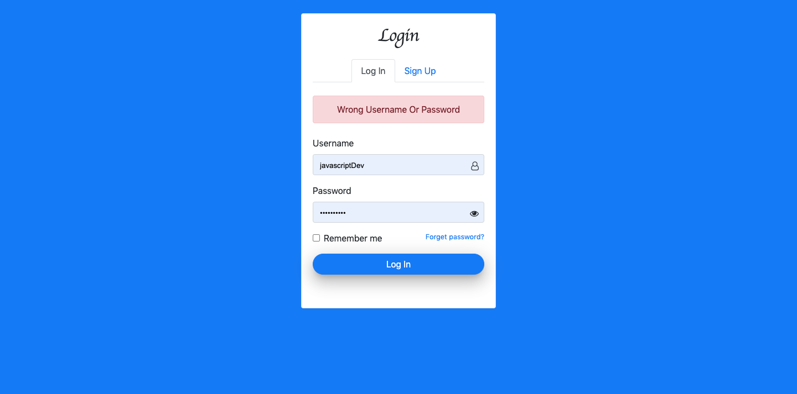

# Login Authentication
Login Authentication with Forgot Password Functionality

### 1.Login Panel

### 2.Login Validation

### 3.Login Validation Error

### 4.Signup Panel

### 5.Send Request For Password Recovery

### 6.Password Recovery Mail Send To User's Gmail Account

### 7.Email Received By User

### 8.URL For Password Recover

### 9.Password Reset Panel

